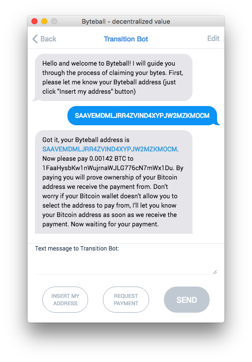

## Jeśli jesteś posiadaczem BTC, to warto skorzystać z darmowej dystrybucji tokenu Byteball.

[Byteball](https://byteball.org/) ma wycenę [ponad 150 mln USD](https://coinmarketcap.com/currencies/byteball/) i z opisu wygląda bardzo ciekawie i solidnie. Także portfel Byteball jest dość porządnie zrobiony (przynajmniej w wersji Android). Ogólnie jest to token warty uwagi.

Dystrybucje Byteball dla posiadaczy BTC są robione regularnie co miesiąc, pierwsza była w grudniu 2016:

> The first distribution round took place on Dec 25, 2016 when the network launched, over 70,000 BTC was linked, and 10% of the total supply of bytes and blackbytes was distributed. In the subsequent rounds, the total distributed supply reached 36.6%:
>
> - 2nd round on Feb 11, 2017: 121,763 BTC linked, 1.8% distributed;
> - 3rd round on Mar 12, 2017: 129,139 BTC linked, 2.0% distributed;
> - 4th round on Apr 11, 2017: 145,441 BTC linked, 2.3% distributed;
> - 5th round on May 10, 2017: 207,672 BTC linked, 2.9% distributed;
> - 6th round on Jun 9, 2017: 453,621 BTC linked, 6.6% distributed;
> - 7th round on Jul 9, 2017: 949,004 BTC linked, 11.0% distributed.

Źródło: [byteball.org](https://byteball.org/)

Czyli do tej pory z dystrybucji skorzystało jedynie około 6% posiadaczy BTC (zlinkowano 1 mln BTC z 16 mln BTC w obiegu).

---

Tak jest opisany cel tej dystrybucji:

> Byteball aims to decentralise storage and transfer of value, and is interesting because of its new consensus algorithm approach. Byteball’s developers believe that the success of the currency depends on the number of people owning and using it. That’s why they decided against ICO crowdsale, but to distribute 98% of all currency **free of charge among Bitcoin holders** instead. 

Źródło: [Iconomy](https://medium.com/iconominet/iconomi-acquires-9-766-of-byteball-initial-distribution-free-of-charge-cd9c4a5d49ac)

---

Kolejna dystrybucja będzie 7 sierpnia:

> The 8th round is scheduled for the full moon of August (**Aug 7, 2017 at 18:10 UTC**). The balances will be snapshotted at the time of the first Bitcoin block after this date,

Źródło: [byteball.org](https://byteball.org/)

---

Dodatkowo wygląda na to, że kolejne dystrybucje się kumulują:

> If you already participated or bought bytes on an exchange, you can multiply your holdings. 

Źródło: [dailybyteball.blogspot.com](http://dailybyteball.blogspot.com/2017/05/participation-in-byteball-distribution.html)

Więc im wcześniej się w to wejdzie, tym potencjalnie większa korzyść:

> We will likely have more rounds until we distribute all 98%, the rules in the future rounds will change in favor of current holders of bytes.

Źródło: [byteball.org](https://byteball.org/)

---

Operację linkowania adresu BTC do dystrybucji Byteball robi się w następujący sposób:

(1) Najpierw trzeba sobie zainstalować portfel Byteball, dostępny na ich [oficjalnej stronie](https://byteball.org/) pod menu *Wallet*.

(2) Następnie, w tym portfelu trzeba wejść do zakładki *Chat* i wybrać opcję *Transition bot*. Wtedy uruchomi się automat, który podpowie jakie są następne kroki. 

Udowodnienie posiadania dostępu do adresu bitcoinonego następuje poprzez przesłanie małej kwoty (0.000907 BTC) z tego adresu na adres podany przez bota:

Po zakończeniu powyższej operacji linkowanie powinno być widoczne na [tej liście](http://transition.byteball.org/).

Źródło: [bitcointalk.org](https://bitcointalk.org/index.php?topic=1608859.0)